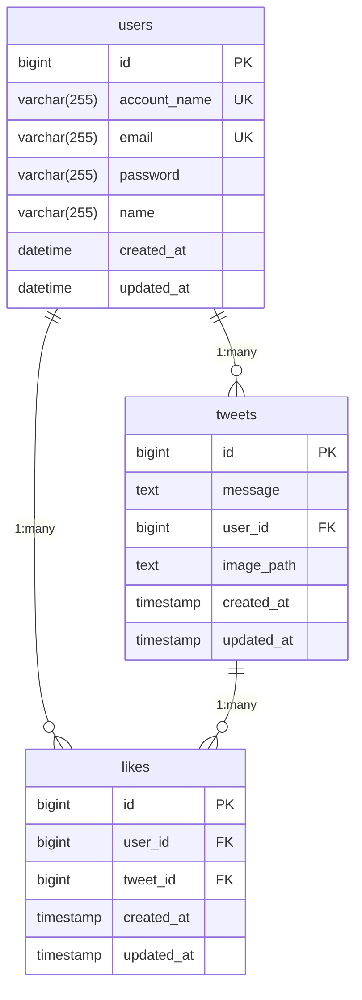

```mermaid
erDiagram
   users {
       bigint id PK
       varchar(255) account_name UK
       varchar(255) email UK
       varchar(255) password
       varchar(255) name
       datetime created_at
       datetime updated_at
   }

   tweets {
       bigint id PK
       text message
       bigint user_id FK
       text image_path
       timestamp created_at
       timestamp updated_at
   }

   likes {
       bigint id PK
       bigint user_id FK
       bigint tweet_id FK
       timestamp created_at
       timestamp updated_at
   }

   users ||--o{ tweets : "1:many"
   users ||--o{ likes : "1:many"
   tweets ||--o{ likes : "1:many"
```